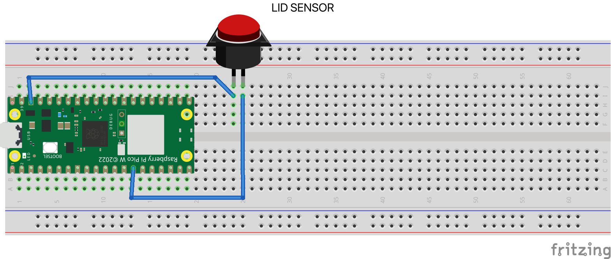
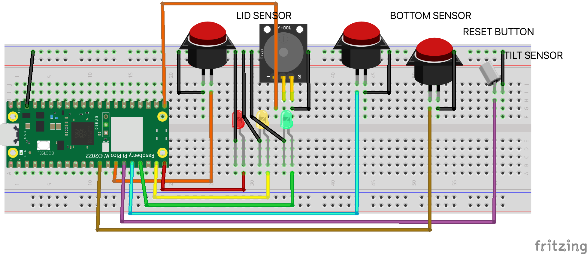
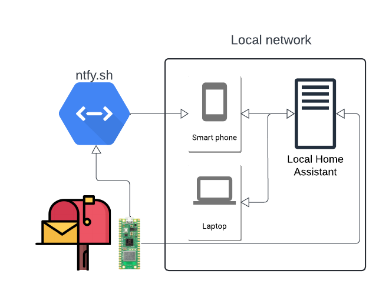

# Mailbox
_Johan Lundström - jl226ki_

A simple (perhaps even crude) Raspberry Pi Pico setup (in MicroPython) for sort of knowing if someone (maybe even a mailman) or something :alien: has been fiddling with your mailbox today.

## TL;DR
- This is all about making a less dump mailbox, so I won't feel compelled to go check it 5+ times per day. (I would not go as far as calling it smart)
- If any of the 3 sensors (tilt of the lid, lid opening, bottom switch being pushed by something in the mailbox) are triggered for long enough, the mailbox will send a request to Home Assistant and ntfy.sh
- Power management could be better, but it is not terrible either.
- The system is designed to be local first, but ntfy.sh is an optional cloud service (you don't need it, but it can be nice to have)
- I have put some effort into making the code (`main.py`) somewhat robust and easy to configure for different setups (`settings.yaml` file)
- Here is video of the system running and the three different sensors being active for a short time and the system signaling this by flashing the different LEDs.

_Please enjoy this video of the different sensors being triggered briefly, and then finally a mail delivery event being triggered (by activating a sensor for long enough)_

https://github.com/lundstrj/mailbox/assets/1045735/d2899a08-660c-4be2-924c-64ea70c737d7

<!-- TOC -->
* [Mailbox](#mailbox)
  * [TL;DR](#tldr)
  * [Overview](#overview)
    * [The problem](#the-problem)
    * [The solution](#the-solution)
    * [Time to complete](#time-to-complete)
    * [What different blinking (and buzzing) patterns mean](#what-different-blinking-and-buzzing-patterns-mean)
  * [Objective](#objective)
    * [Why?](#why)
    * [Purpose](#purpose)
    * [Insights](#insights)
  * [Bill of materials](#bill-of-materials)
  * [Assembly instructions](#assembly-instructions)
    * [Computer setup](#computer-setup)
      * [My setup](#my-setup)
      * [High level step-by-step instructions on how to set up a Pico like I did](#high-level-step-by-step-instructions-on-how-to-set-up-a-pico-like-i-did)
    * [Bare-bones wiring setup](#bare-bones-wiring-setup)
    * [Full fat breadboard wiring setup](#full-fat-breadboard-wiring-setup)
    * [Assembly and sticking it in an actual mailbox](#assembly-and-sticking-it-in-an-actual-mailbox)
    * [Power draw, expected and actual (and adventures in power management)](#power-draw-expected-and-actual-and-adventures-in-power-management)
  * [Platform](#platform)
    * [High level diagram of the system](#high-level-diagram-of-the-system)
    * [Elaboration](#elaboration)
    * [Scaling](#scaling)
  * [Code](#code)
    * [Initialization / setup](#initialization--setup)
    * [Loading a yaml file in micro python](#loading-a-yaml-file-in-micro-python)
    * [Main loop](#main-loop)
    * [Determining if mail has been delivered in the last x samples](#determining-if-mail-has-been-delivered-in-the-last-x-samples)
    * [Handling flaky wifi on the Pico](#handling-flaky-wifi-on-the-pico)
    * [Testing](#testing)
      * [What has been done](#what-has-been-done)
      * [What has NOT been done](#what-has-not-been-done)
      * [What could have (reasonably) been done](#what-could-have-reasonably-been-done)
  * [Connectivity and Data visualization](#connectivity-and-data-visualization)
  * [Data security/sensitivity considerations](#data-securitysensitivity-considerations)
  * [In the end](#in-the-end)
<!-- TOC -->

## Overview
### The problem
My current residence get intermittent mail delivery (supposedly every other day for mail, but packages can come any day). Some days you don't get anything even if it is a mail delivery day. The mail also gets delivered at different times depending on reasons (I suppose), so what does one do? Well you go check your mailbox at least 5+ times per day just to be sure.

If only there was a better way.

### The solution
There is a better way!

Get a microcontroller and some sensors and hook them up to your mailbox. This way you can know if the mailman has been by today or not. You can even get fancy and hook it up to your home automation system to get notifications when mail has been delivered.

### Time to complete
__2 hours__<br>
If you have my code, all the hardware and a mailbox and know how to flash code onto a Pico (or possess the ability to follow one of the many many [online tutorials and guides](https://www.raspberrypi.com/documentation/microcontrollers/micropython.html#:~:text=Push%20and%20hold%20the%20BOOTSEL,Your%20Pico%20will%20reboot.)) you can probably get this done in an hour or two.

_(it took me significantly longer, but I was also prototyping and testing a lot of things along the way)_

__TODO: picture of mailbox__<br>


### What different blinking (and buzzing) patterns mean
_For your convenience, enjoy this incomplete list_
- __Green, yellow and red LEDS filling up and going back down__ - Mailbox is in the init state, checking sensors and connecting to wifi
- __On Board LED blinking once per second__ - Mailbox is powered, connected to wifi on and running (waiting for mail)
- __On Board LED blinking once every 10 seconds__ - Mailbox is powered, has detected mail and is now in a sort of sleep mode (waiting to be reset by the user)
- __Green, yellow and red LEDS toggle on/off in sequence once and a short 2x buzz__ - Mailbox is resetting (user has pressed the reset button)

## Objective
### Why?
I'd like to know if mail has been delivered today or not without having to check the mailbox (walk out and lift the lid).
### Purpose
To notify me (in Home Assistant Dashboard and by a push notification to my phone) if and when mail has (probably) been delivered to my mailbox.
### Insights
The main insight is the binary state of mail present in my mailbox, or not. With the events sent to Home Assistant I would also be able to plot delivery times, see if any specific days seem to be more likely to have mail delivered. I'll be able to see if mail delivery patterns change over time (say if the mailman changes route or if the mailman changes. Perhaps there are seasonal changes?). 

## Bill of materials
Basically you need a microcontroller and a couple of buttons. I used a Raspberry Pi Pico W and some push buttons and a tilt sensor (mainly to be fancy). You can get away with only one push button if you'd like, but I will be using the following:

| Component image                           | Component name           | Quantity | Price    |  Product link |
|-------------------------------------------|--------------------------|----------|----------|---|
|                      | Raspberry Pi Pico W      | 1        | 109 SEK  |  https://www.electrokit.com/raspberry-pi-pico-wh |
|               | Breadboard               | 1        | 69 SEK   |  https://www.electrokit.com/kopplingsdack-840-anslutningar |
|               | Push button              | 3        | 16.5 SEK |  https://www.electrokit.com/tryckknapp-1-pol-off-onmetall-gron-lodoron |
|               | Tilt switch/sensor       | 1        | 15 SEK   |  https://www.electrokit.com/tiltswitch-5vdc-vertikal |
|              | male-male jumper wires   | 1        | 39 SEK   | https://www.electrokit.com/kopplingstrad-byglar-for-kopplingsdack-mjuka-65st |
|  | male-female jumper wires | 1        | 29 SEK   | https://www.electrokit.com/labsladd-1-pin-hane-hona-150mm-10-pack |
|                 | Green LED                | 1        | 8 SEK    | https://www.electrokit.com/led-5mm-gron-inbyggt-motstand-5v |
|                | Yellow LED               | 1        | 8 SEK    | https://www.electrokit.com/led-5mm-gul-inbyggt-motstand-5v |
|                   | Red LED                  | 1        | 8 SEK    | https://www.electrokit.com/led-5mm-rod-inbyggt-motstand-5v |
|                   | Mailbox                  | 1        | 299 SEK  | https://www.biltema.se/fritid/tradgard/entre/brevlador/brevlada-med-las-vit-2000053657 |
|                    | Buzzer                   | 1        | 39 SEK   | https://www.electrokit.com/piezohogtalare-aktiv |

## Assembly instructions
I used a Pico WH on a breadboard to prototype this. I also added LEDs and a buzzer to help me see the state without hooking up a debugger. You can do that too if you want to, or just skip all of that and wire up the bare bones setup in that section :point_down:

### Computer setup
I am not going to go very deep into this, it is instead left mostly as an exercise for the reader. Many guides exist on how to set up a Raspberry Pi Pico, and I am sure you can find one that [suits your needs](https://www.raspberrypi.com/documentation/microcontrollers/micropython.html#:~:text=Push%20and%20hold%20the%20BOOTSEL,Your%20Pico%20will%20reboot.).
You will need some sort of computer to write the code on. You will need something with a USB port so that you can flash the Pico with your code. You will need some sort of tool which can flash the Pico with your code (beginners might want to start with [Thonny](https://thonny.org/), some people go with [VSCode](https://code.visualstudio.com/), I went with [PyCharm](https://www.jetbrains.com/pycharm/). Dealers choice really).

#### My setup
- development system: A MacBook Pro (it really doens't matter, any computer built in the past 15 years will likely do just fine)
- IDE: [JetBrains PyCharm](https://www.jetbrains.com/pycharm/) (community edition)
- IDE-plugin: Jetbrains [MicroPython plugin](https://plugins.jetbrains.com/plugin/9777-micropython)
- Tool for initial Pico setup: Thonny (just for adding the MicroPython firmware to the Pico and then not touched again)

#### High level step-by-step instructions on how to set up a Pico like I did
- Install [Thonny](https://thonny.org/) _(I do not recommend pip for this as it resulted in SSL errors for me)_
- Connect the Pico to your computer via USB
- Use Thonny to add the MicroPython firmware to the Pico
- Install [PyCharm](https://www.jetbrains.com/pycharm/)
- Install the [MicroPython plugin for PyCharm](https://plugins.jetbrains.com/plugin/9777-micropython)
- Write some code in PyCharm :point_down: into a file called `main.py`
```python
import machine
import utime

led_non_w = machine.Pin(25, machine.Pin.OUT)
led_w = machine.Pin("LED", machine.Pin.OUT)

while True:
    led_non_w.toggle()
    led_w.toggle()
    utime.sleep(1)
```
- use PyCharm to flash `main.py` to the Pico (this will also run your code on the Pico) 

- Enjoy the little on-board LED blinking
- If you got flashing lights :point_up: then you are now ready to start setting up Mailbox

#### High level step-by-step instructions for setting up Mailbox on an already prepared Pico
- Open and edit `settings.yaml` to reflect your setup (set credentials, tell Mailbox which pins have what connected to them)
- Flash `settings.yaml` to the Pico
- Flash `main.py` to the Pico
- IF you want to use the Home Assistant integration, you will need to [set up Home Assistant](https://www.home-assistant.io/installation/) (you don't need to have it)
- IF you want to use the push notificaiton feature through [ntfy.sh](https://ntfy.sh/) then you'll need to set that up too (you don't need to have it)
- The Pico should reset automatically and start right up. It will keep trying to connect to Wifi until it succeeds. If it managed to connect to WiFi it will go into mail monitoring mode (which is indicated by the on board LED fashing about once per second)

### Bare-bones wiring setup
_I am sure you won't have any issues, you don't need any of those flashy LEDs ;-)_



### Full fat breadboard wiring setup


### Actuan circuit diagram
This has been omitted since the diagrams ☝️ offer more than enough clarity for how to wire up this very basic system.
It really isn't important which LEDs you use, as long as they are ballpark OK for 3.3-ish Volts we can get from the Pico.

### Assembly and sticking it in an actual mailbox
__TODO: Stick it all into an actual mailbox__

### Power draw, expected and actual (and adventures in power management)
A pico (with WiFi) can draw as much as 0.5W at startup (depending on workload this tends to level out at about 0.15W).
Mailbox does very little work and in fact spends most of the time sleeping, so the expected power usage is at 0.15W.

HOWEVER, there are additional LEDs and a Buzzer connected, which will draw a bit of power when used. The thing is that they are used so rarely and for such a short time that this additional power draw becomes within the margin of measurement error for the expected power usage.
All the used sensors are passive and draw no power at all for the most part and negligible power when they are used.

Using the Wifi to send request will draw more power than just idling, but again, this is done so rarely that it over time becomes negligible.

(Mailbox could/should be redesigned to use pretty much no power at all by only switching on when the mailbox lid is lifted and then shutting down again after a few seconds. This would require a bit of extra hardware and a bit of extra code, but would be a good design choice for a battery powered mailbox system. It would also only switch on the radio and connect to Wifi, if and when mail has been detected. Mailbox is not designed to run on battery power as batteries tend to struggle in low temperatures and mailboxes have a tendency to be placed outside in the cold.)

Attempting to measure the power draw at the source (at the power supply or the wall plug) both resulted in measurements so low that it registers as 0W. The actual number is obviously higher than 0 as the device is indeed powered on but this still helps us gain some confidence in that hand-waving numbers mentioned :point_up: might be ballpark.


## Platform
I went with a Raspberry Pi Pico WH running MicroPython since I have previous experience with Python and the tooling around Raspberry devices is usually quite nice to work with.
In addition to the hardware I also use a [Home Assistant server](https://www.home-assistant.io/installation/) (not that it matters but it runs on Raspberry Pi4) to visualize the data from the mailbox.
I also use [ntfy.sh](https://ntfy.sh/) to send notifications to my phone when mail has been delivered.

This is local first setup (with the option to pay for Home Assistant Cloud in the future if I should want to).
In order to still get notifications on my phone I have set up a little companion app which subscribes to topic the Pico can post to. I went with [https://ntfy.sh/](https://ntfy.sh/) for this.

### High level diagram of the system


### Elaboration
I consider cloud functionality to be an unnecessary attack vector and an inconvenience for most of my use cases. Sure, it might be occasionally nice to have, but I prefer to keep things local and under my control (also without any unnecessary running costs).
This preference and the truly outstanding tooling around Raspberry Pi devices is why I went with Home Assistant on a Raspberry Pi (instead of some cloud service).

I chose a MacBook Pro for my development environment simply because I have one. Without the MBP I would have used a Linux machine with all the same tooling.
Also, we are in Småland so why pay for things unless you need to?

(it makes sense to pay for a service such a GCP or AWS for when you don't want to or cant host your own metal. Using a cloud service to see the temperature in the room you are in, of if there is mail in the metal box 20 meters away from your house is almost perverse)

### Scaling
This little hobby project is not designed with scaling in mind. A Pico is gross overkill for what this project does. The physical nature of the project also doesn't scale well as it currently needs custom installation to meet the specific mailbox the user happens to have.
HOWEVER, the software aspects of this project are fairly well suited for scale. The system is very quiet on the network, only sending about 4 request per day so any server setup to receive the data would be able to handle a large number of mailboxes.
The selected push notification service (ntfy.sh) is also well suited for scale as it has a paid service tier and should be able to handle a large number of notifications (even at a pretty low monthly cost). It is also open enough to allow you to host your very own ntfy server which you can scale to your heart's delight.

## Code
The code can be found in this repo, you want the `main.py` file. Stick that (and `settings.py`) on a Pico W (or WH) and watch it go.
I have taken some care to handle setups wich are different from my own (you don't need all of my sensors, the buzzer, nor the LEDs). You can also configure the pins to match your setup by editing the `settings.yaml` file.

The code is split into two main parts:
1. initialization / setup
2. main loop

### Initialization / setup
This part of the code is responsible for setting up the Pico and the sensors. It also reads the settings from the `settings.yaml` file and sets up the pins accordingly.
It also connects to wifi, pings external services (such as Home Assistant) and tries to reach the public internet to see which features can be used.

https://github.com/lundstrj/mailbox/assets/1045735/3aaea723-b65c-47a8-b1be-75d47a6f56f5

### Loading a yaml file in micro python
Since standard yaml parsers are not available in MicroPython, I had to write my own. It is quite limited and does not handle all yaml files, but it lets me use yaml for settings and gets the job done.
```python
def load_settings(file_name: str) -> dict:
    # with our own homegrown quite limited yaml parser
    # it does handle comments though, sort of
    with open(file_name, 'r') as file:
        _settings = {}
        lines = file.readlines()
        for line in lines:
            if line[0] == '#':
                pass
            elif len(line) == 0:
                pass
            else:
                parts = line.split(':')
                if len(parts) == 2:
                    key = parts[0].strip()
                    value = parts[1].strip()
                    _settings[key] = value
                elif len(parts) > 2:
                    key = parts[0].strip()
                    value = ":".join(parts[1:]).strip()
                    if "#" in value:
                        value = value.split("#")[0]
                    _settings[key] = value
                print(f"key: {key}, value: {value}")
        return _settings


settings_file_name: str = 'settings.yaml'
settings: dict = load_settings(settings_file_name)
```

### Main loop
The main loop continuously samples (the frequence can be configured in `settings.yaml`) the attached sensors and checks if the past x samples (this can be configured in `settings.yaml`) can be considered a mail delivery or not. <br>
If a mail delivery is detected, the Pico will send a message to the Home Assistant server, ping the ntfy.sh service and blink the onboard LED and buzz the buzzer (assuming there is one connected)
The system will then enter a sleep mode for a set amount of time before starting the main loop again (this is to save power) when the user resets the mailbox (by holding the reset button for up to 10 seconds).

Since mail presence in the mailbox is a binary state, it makes little sense to continue to monitor the mailbox after a mail delivery has been detected.

### Determining if mail has been delivered in the last x samples
Since the main loop isn't very interesting on it's own, here is the logic for determining if mail has been delivered in the last x samples.
```python
def check_if_mail_has_been_delivered(list_of_samples: list) -> bool:
    """
        {'lid_open': lid_open,
        'bottom_sensor_active': bottom_sensor_active,
        'tilt_sensor_active': tilt_sensor_active}
    """
    print(f"Checking if mail has been delivered")
    consecutive_tilt_sensor_active = 0
    consecutive_lid_open = 0
    consecutive_bottom_sensor_active = 0
    previous_sample = None
    for sample in list_of_samples:
        if previous_sample is None:
            previous_sample = sample
            continue
        if previous_sample is not None:
            if sample.get('tilt_sensor_active', False) and previous_sample.get('tilt_sensor_active', False):
                consecutive_tilt_sensor_active += 1
            elif not sample.get('tilt_sensor_active', False):
                consecutive_tilt_sensor_active = 0
            if sample.get('lid_open', False) and previous_sample.get('lid_open', False):
                consecutive_lid_open += 1
            elif not sample.get('lid_open', False):
                consecutive_lid_open = 0
            if sample.get('bottom_sensor_active', False) and previous_sample('bottom_sensor_active', False):
                consecutive_bottom_sensor_active += 1
            elif not sample.get('bottom_sensor_active', False):
                consecutive_bottom_sensor_active = 0
            previous_sample = sample
        if (consecutive_tilt_sensor_active > consecutive_tilt_sensor_active_needed_to_trigger
                or consecutive_lid_open > consecutive_lid_open_needed_to_trigger
                or consecutive_bottom_sensor_active > consecutive_bottom_sensor_active_needed_to_trigger):
            print(f"Mail has been delivered")
            return True
    print(f"Mail has not been delivered")
    return False
```

### Handling flaky wifi on the Pico
The Pico can be a bit flaky when it comes to connecting to wifi. I have added a simple retry mechanism to try to connect to wifi a few times before giving up and restarting the device.
```python
def connect() -> network.WLAN:
    print(f"Connecting to WiFi: {ssid}")
    if ssid == 'ssid_not_set' or password == 'password_not_set':  # noqa
        signal_error(ERROR_CODE_WIFI_NOT_CONFIGURED)
        raise ValueError(f"Please set your WiFi SSID and password in {settings_file_name}")
    # Connect to WLAN
    wlan = network.WLAN(network.STA_IF)  # noqa
    wlan.active(True)
    wlan.connect(ssid, password)
    attempts = 0
    while not wlan.isconnected():
        print(f'Waiting for connection ({attempts}/{max_wifi_connect_attempts_before_resetting_device})...')
        time.sleep(1)
        led_on_board.toggle()  # noqa
        attempts += 1
        if attempts > max_wifi_connect_attempts_before_resetting_device:
            print(
                f"Could not connect to WiFi (after {attempts} attempts), please check your {settings_file_name} file and wifi status")
            signal_error(ERROR_CODE_WIFI_NOT_CONNECTED)
            print("Resetting the device")
            reset()
    print(wlan.ifconfig())
    signal_success(2)
    led_on_board.high()
    print(f"Connected to WiFi: {ssid}")
    return wlan
```

### Testing
#### What has been done
- Mailbox has been extensively tested in my lab as an assembled system.
- I have tested each individual sensor standalone to ensure that they work as expected (before assembly)
- The WiFi connection, the Home Assistant connection and the ntfy.sh connection has also been tested in isolation and have simple error handling for common problems.
- There are some basic preflight checks before the main loop starts to ensure that the system is in a good state before starting the main loop.
- The classes imported from the Machine library have been mocked in mock.py which allows tests to be carried out on the logic separately from the hardware.

#### What has NOT been done
There is little to no error handling for hardware malfunctions at run time (say one sensor out of 3 starts misbehaving, there is currently no logic to handle that)

#### What could have (reasonably) been done
Automated testing in a CI/CD pipeline would have been nice to have. I have not set this up as time is still not infinite, and it would require having my own Github Runner in order to have a Pico hooked up to be able to test the whole system.

## Connectivity and Data visualization
Mailbox is equipped with logic to send data to a Home Assistant server, which can then be used to visualize the data in a pretty straight forward way.<br><br>
Data is, on average, sent to Home Assistant 2 times per day IF mail is delivered that day. On average this results in about 12 request per week (one request to tell Home Assistant there is mail in the mailbox, one request to for when the system is reset, one request to tell Ntfy to notify the subscribers and one request to Ntfy for when the mailbox has been reset)
This current setup is relying on WiFi for all data communication (but the full fat setup also has lights and a buzzer to communicate with the user).

Bog-standard HTTP requests are used to send data to Home Assistant and to NTFY. The request frequency and data amount is so low that it is not worth optimizing for this project in its current scope.
If anything, WiFi is gross overkill for the data transfer needs (it is also probably the biggest power drain of this system) of this project BUT it had the one main advantage of being an already available network on site and being easy to work with. WiFi was used due to convenience, not because it is the best tool for the job.
Given my bandwidth and range needs, I'd argue that Zigbee would be a better choice. LoRa would be overkill in terms of range and would also incur a higher cost for the hardware and operating costs (but would be nice from a power draw point of view). LTE offers loads of bandwidth (which I don't need) and would also add costs for the hardware and running.
Low Energy Bluetooth would have be a good alternative, provided the mailbox is in range of the Home Assistant. (This would also require reworking how the data gets sent from the Pico to the Home Assistant server and Ntfy. A good technological choice nonetheless)

The main reason to go with Home Assistant as my "database" and visualization solution is much like the decision to go with Wifi, out of convenience.
I already had a Home Assistant setup. It has built in functionality for doing what I need out of this mailbox system. It could be argued that going with Grafana would have been a better choice for visualization, but with binary output, from only one source, which changes at most twice per day, I don't see the need for a more advanced visualization tool.
There is currently no automation setup which is using the input from this mailbox system. Since mail (currently) needs to be fetched manually, I just didn't see a need to go beyond dashboard and push notifications. 

Please enjoy this video of a phone getting push notifications:

https://github.com/lundstrj/mailbox/assets/1045735/c4a27314-9a62-4c77-ac87-b9dbb52fd659

What things look like in Home Assistant<br>

<br>


## Data security/sensitivity considerations
The data transmitted by Mailbox is a binary mail or no mail state. It lacks any PII and is not sensitive in any way.
The Ntfy topic is wide open, anyone can subscribe to it if they'd like to. This could, in theory, be used to plan mail theft from me, by waiting near by and then springing to action when the mail delivery event is fired.
However, the mail delivery schedule is public and it would be about as easy to just wait nearby for when the mail truck goes by. Since my mailbox is basically just a box with a lid, which anyone can open, I figured I'm not really making things much worse by adding this mailbox notification system to it. If anything, I am reducing the on site attack vector by probably getting my mail sooner than I would otherwise.

Data retention in Home Assistant defaults to 10 days of historical data but this can also be user configured to anywere between not saving anything at all and storing things forever. Since the data generated by Mailbox is so tiny in both size and frequence, I could, if I wanted, store years and years worth of mail delivery data. However, in practice, I suspect I will rarely have a need for more than the default 10 days (heck, I probably don't need more than a couple of days). This is really more of a "because I can" sort of thing. The push notifications to my phone are likely more useful than the Home Assistant visualisation.

## In the end
I have a mailbox that can tell me if mail has been delivered today or not. I can also see this information in Home Assistant and get notifications on my phone if I want to.
Looking back I cannot help but feel like this kind of microcontroller is gross overkill for this project, but we need to also factor in speed of development, which is hard to beat for a project with a low low volume of one.

There are about a thousand things I could have done differently and better.
Mainly power draw is something I'd be keen to improve. Consider the following:

- With working power modes on a Pico, I would be able to sleep for most of the time (not much mail being delivered at night().
- Having the radio on all of the time really isn't needed. It could be turned on for a few seconds only when requests need to go out. This would add a slight delay since wifi would need to power up and connect before any notifications can go out, but I'd say it would still be a better design choice.
- With a simple circuit, the Pico could actually be powered on only when the mailbox lid has been lifted (this drawing no power at all until it is needed) and then staying on only until mail has been detected, at which point it would shut down again until the next time the lid is lifted.
- Since the Pico is a dual core microcontroller, I could also have one core running the main loop and the other core handling the wifi connection and message sending. This would allow me to have purer logic (as the current implementation can in practice miss mail delivery samples if it is in the middle of flashing ligths or buzzing a buzzer since only one thread is used and execution is strictly sequential)
- I could implement requests to a somewhat accessible PostNord API to determine if today is a PostNord delivery day or not. This could be displayed as a sensor in Home Assistant too.
- I could add a little ultra sound sensor to detect if something is by the mailbox for x seconds (or longer) to try to figure out if the post car has been there or not (it would take at least a solid 5-10 seconds for a mailman to stop, deliver mail and do a burnout).
- I could add a little handy button for the mailman to press (if they feel like it) to explicitly trigger a mail delivery event.

Next up after that I reccon we'd be in image processing territory. But really, I 100% expect a system with just one button and an electric flip switch hooked up to a light (which would then stay on) to work just about as well as anything mentioned ☝️

Overall, I am pleased with my setup and choice of tools. Home Assistant performed well and was a dream to setup. Ntfy.sh was also a breeze to setup and use. The Pico can be a bit flaky in terms of connecting to wifi but wasn't difficult to work around with a few lines of code. It did bother me a bit that the different power modes supported in MicroPython are not all implemented in the Raspberry Pico and using IRQs to wake the Pico up from lightsleep did not work as documented. The Pico is the Raspberry Foundation's first microconroller, and power draw and power modes are traditionally things that are hard to get right on the first try. ESP32/Arduino is much more mature and have also gotten further in these areas. Moving this over to Arduino and away from WiFi to Zigbee AND only powering on when the mailbox lid is lifted will likely let me run this thing on a couple of AA batteries for months (maybe years) without needing to swap batteries<br>
 4 toast points out of 5, [Kanonkul](https://youtu.be/pYPjFpixTP8?t=57).

_(not that anyone asked but I listened to a fair bit of [SMK - Fest i Valen](https://sv.wikipedia.org/wiki/Fest_i_valen_(musikalbum)) during this project)_<br>
_(<a href="https://www.flaticon.com/free-icons/mailbox" title="mailbox icons">Mailbox icons created by Nikita Golubev - Flaticon</a>)_<br>
_(<a href="https://www.flaticon.com/free-icons/bread" title="bread icons">Bread icons created by Freepik - Flaticon</a>)_
